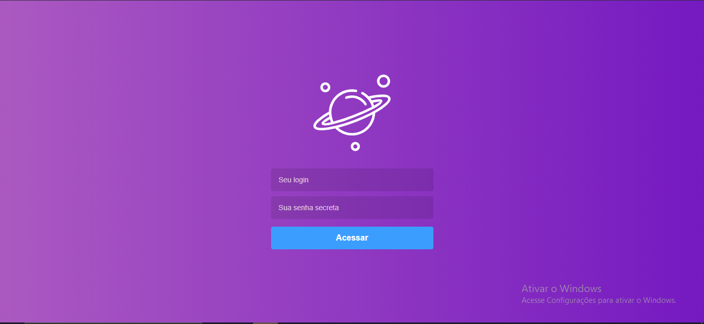
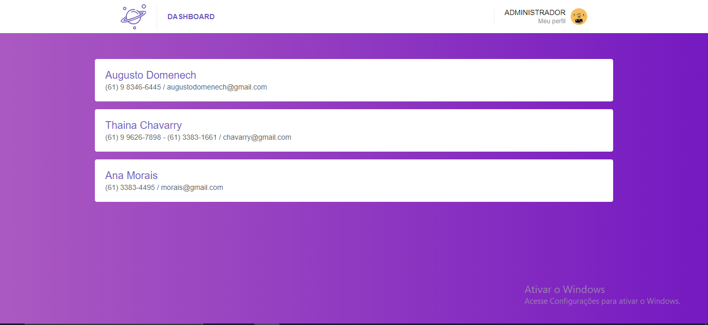
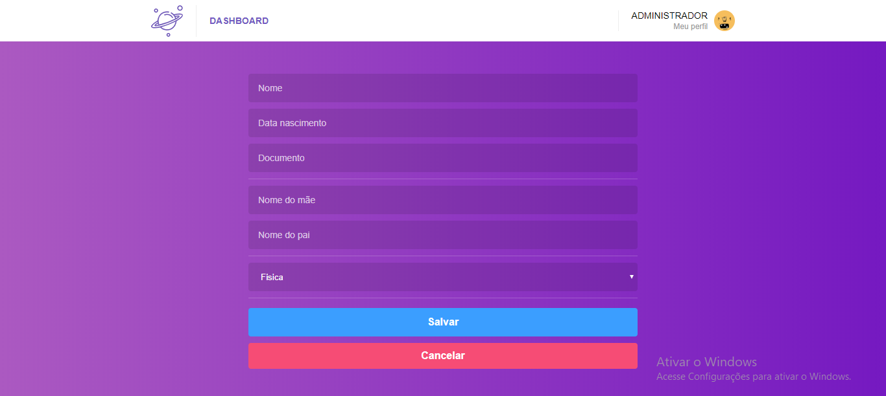
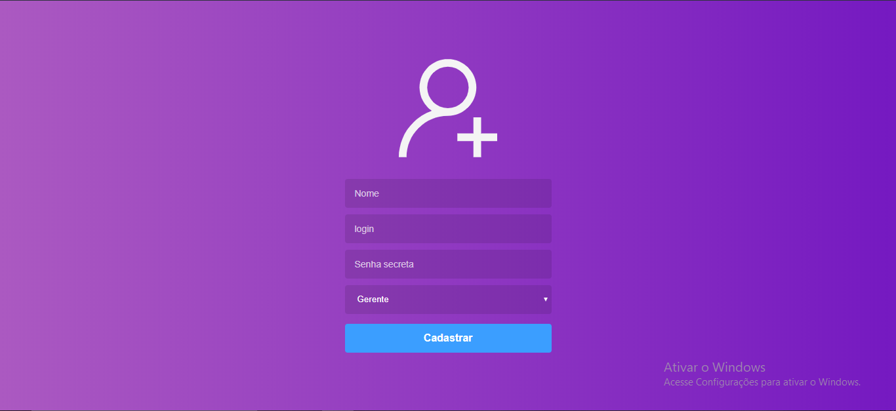

# desafio_frontend

#Telas codificadas

No front-end pelo tempo de trabalho foi mais implementado o layout e navegação da aplicação da aplicação. 

Login - implementado a busca na api, para validação do usuário

Dashboard - 70%

Cadastro - 60%

Cadastro usuário - 80%

